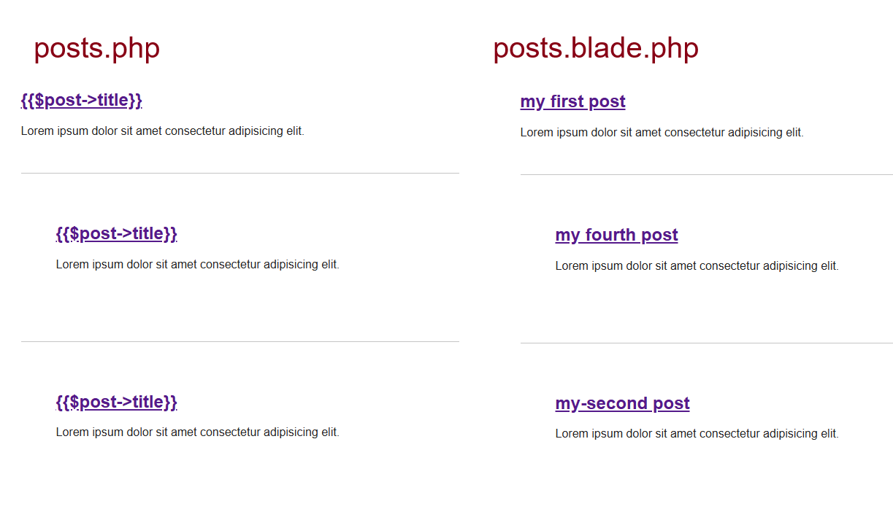

[< Volver a la pagina principal](/docs/readme.md)

# Blade: The Absolute Basics

Blade es el motor de plantillas de Laravel para tus vistas. Se puede pensar en él como una capa sobre PHP que permite que la sintaxis necesaria para construir estas vistas sea lo más limpia y concisa posible. En última instancia, estas plantillas Blade se compilarán a PHP básico en segundo plano.

Para empezar modificamos el post.blade.php de la siguiente forma, para que se interprete el blade
```php
    <body>
        <?php foreach ($posts as $post) : ?>
            <article>
                <h1>
                    <a href="/posts/<?= $post->slug; ?>">
                        {{$post->title}}
                    </a>
                </h1>
                <div>
                    <?= $post->excerpt; ?>
                </div>
            </article>
        <?php endforeach; ?>
    </body>
```

En una partilaridad es que podemos quitar en el nombre el .blade, sin embargo, esto generaria un problema al querer visualizar el titulo



Modificamos el archivo `posts.blade.php`, para que use un @foreach para cargar la lista de posts

 ```html
 <body>
    @foreach ($posts as $post)
    <article class="{{ $loop->even ? 'foobar' : '' }}">
        <h1>
            <a href="/posts/{{ $post->slug }}">
                {{ $post->title }}
            </a>

        </h1>

        <div>
            {{ $post->excerpt }}
        </div>
    </article>
    @endforeach
</body>
```

Y tambien el post.blade.php que es el de cada post

 ```html
 <body>
    <article>
        <h1>{{ $post->title }}</h1>

        <div>
            {!! $post->body !!}
        </div>
    </article>

    <a href="/">Go back</a>
</body>
```
