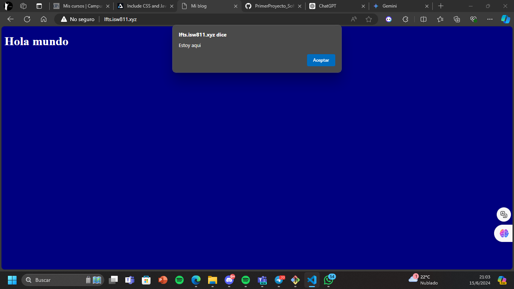

[< Volver a la pagina principal](/docs/readme.md)

# Include CSS and JS

Para este episodio se muestra como podemos editar los parametros de la pagina web

Primero nos dirigimos a la vista welcome borramos su contenido y ponemos lo siguiente:
```html
<!DOCTYPE html>	

<title>Mi blog</title>
<link rel="stylesheet" href="/app.css">
<script src="/app.js"></script>

<body>
    <h1>Hola mundo</h1>
</body>
```


Vamos a crear un archivo `/public/app.css` con el siguiente contenido.

```css
body {
    background: navy;
    color: white;
}
```

Y luego vamos a crear el archivo `/public/app.js` con el siguiente contenido.

```javascript
alert('Estoy aqui');
```

Y el resultado seria el siguiente: 


