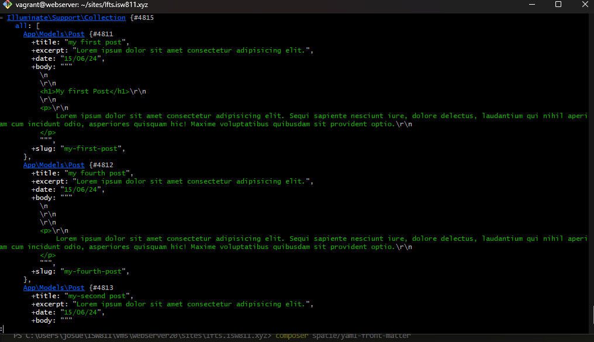

[< Volver a la pagina principal](/docs/readme.md)

# Collection Sorting and Caching Refresher

Gracias a las configuraciones hechas, cada publicación ahora incluye la fecha de publicación como parte de sus metadatos, sin embargo, la fuente actualmente no está ordenada según esa fecha. Afortunadamente, como estamos usando colecciones de Laravel, tareas como esta son pan comido. En este episodio, corregiremos la ordenación y luego discutiremos el almacenamiento en caché "permanente".


Modificamos la funcion All() de post.pphp para que esta ordene los post en orden alfabetico

```php
 public static function all()
    {
        return cache()->rememberForever('post.all', function () {
            return collect(File::files(resource_path("posts")))

                ->map(fn ($file) => YamlFrontMatter::parseFile($file))
                ->map(fn ($document) => new Post(
                    $document->title,
                    $document->excerpt,
                    $document->date,
                    $document->body(),
                    $document->slug
                ))
                ->sortByDesc('date');
        });
    }
```
Nos metemos en vm en la carpeta del proyecto, y con los siguientes comandos podemos visualizar lo que está alcacenado en la memoria caché

```bash
    php artisan tinker
    cache('post.all')
```

Nos saldra algo similar a esto:


