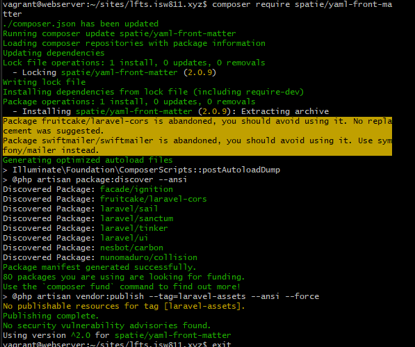

[< Volver a la pagina principal](/docs/readme.md)

# Find a Composer Package for Post Metadata


En este capitulo se instala Yaml la cual es una herramienta de composer

En nuestra vm nos dirigimos a la carpeta de nuestro proyecto e instalamos las librerias de Yaml front matter:

```bash
$ composer require spatie/yaml-front-matter
```



Se modifica el archivo Post.php de la siguiente forma:

```php
<?php

namespace App\Models;

use Illuminate\Database\Eloquent\ModelNotFoundException;
use Illuminate\Support\Facades\File;
use PhpParser\Node\Expr\FuncCall;

class Post
{
    public $title;

    public $excerpt;

    public $date;

    public $body;

    public $slug;

    public function __construct($title, $excerpt, $date, $body, $slug)
    {
        $this->title = $title;
        $this->excerpt = $excerpt;
        $this->date = $date;
        $this->body = $body;
        $this->slug = $slug;
    }

    public static function all()
    {
        $files = File::files(resource_path("posts/"));

        return array_map(fn($file) => $file->getContents(), $files);
    }

    public static function find($slug)
    {
        base_path();
        if (!file_exists($path = resource_path("posts/{$slug}.html"))) {
            throw new ModelNotFoundException();
        }

        return cache()->remember("post.{$slug}", 1200, fn () => file_get_contents($path));
    }
}


```

Ahora en el web.php lo modificamos para que pueda retornar los atributos del contructor

```php
Route::get('/', function () {

    $files = File::files(resource_path("posts/"));
    $posts = [];

    foreach ($files as $file) {
        $documents = YamlFrontMatter::parseFile($file);

        $posts[] = new Post(
            $documents->title,
            $documents->excerpt,
            $documents->date,
            $documents->body(),
            $documents->slug
        );
    }

    return view('posts', [
        'posts' => $posts]);
});

```


En el posts.blade.php hacemos lo siguiente para llamar los atributos de la clase

```html
<body>
    <?php foreach ($posts as $post) : ?>
        <article>
            <h1>
                <a href="/posts/<?= $post->slug; ?>">
                    <?= $post->title; ?>
                </a>

            </h1>

            <div>
                <?= $post->excerpt; ?>
            </div>
        </article>
    <?php endforeach; ?>
</body>

```

Para este punto nuestro objetivo principal ya debe de funcionar, a continuacion se hacen cambios para limpiar el codigo:

Ajuste al archivo `web.php` 


```php
Route::get('/', function () {

    $posts = collect(File::files(resource_path("posts")))

        ->map(fn ($file) => YamlFrontMatter::parseFile($file))
        ->map(fn ($document) => new Post(
            $document->title,
            $document->excerpt,
            $document->date,
            $document->body(),
            $document->slug
        ));

    return view('posts', [
        'posts' => $posts
    ]);
});

```


Editamos el Post.php de la siguiente forma:

```php
    use Spatie\YamlFrontMatter\YamlFrontMatter;


 public static function all()
    {
        return collect(File::files(resource_path("posts")))

            ->map(fn ($file) => YamlFrontMatter::parseFile($file))
            ->map(fn ($document) => new Post(
                $document->title,
                $document->excerpt,
                $document->date,
                $document->body(),
                $document->slug
            ));
    }

```

editamos el web.php para que retorne la funcion all

```php
Route::get('/', function () {

    return view('posts', [
        'posts' => Post::all()
    ]);
});
```

En el post.php se modifica el find de la siguiente forma
```php
public static function find($slug)
{
    return static::all()->firstWhere('slug', $slug);
}
```


Por ultimo editamos el post.blade.php para que cada post cargue sus datos.

```Html
<!DOCTYPE html>
<html lang="en">

<head>
    <meta charset="UTF-8">
    <meta name="viewport" content="width=device-width, initial-scale=1.0">
    <link rel="stylesheet" href="/app.css">
    <title>My Blog</title>
</head>

<body>
    <article>
        <h1><?= $post->title; ?></h1>

        <div>
            <?= $post->body; ?>
        </div>
    </article>

    <a href="/">Go back</a>
</body>

</html>
```


