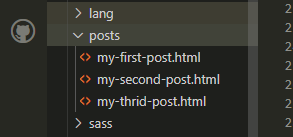
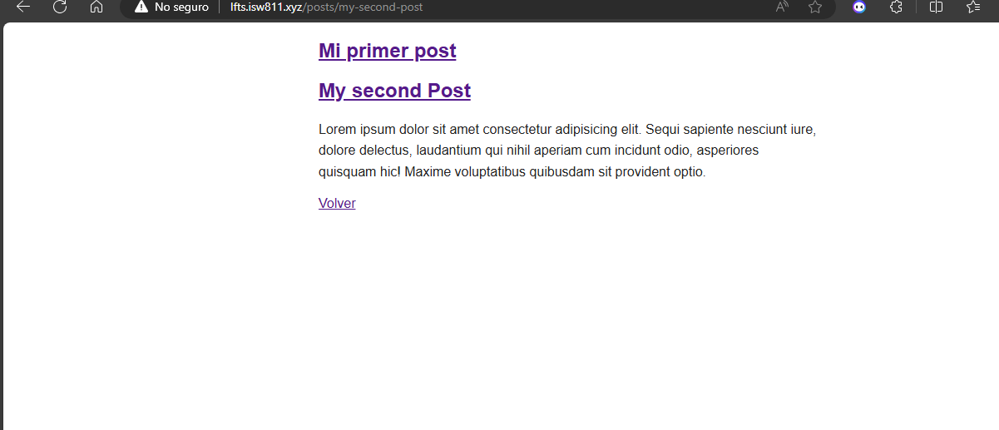

[< Volver a la pagina principal](/docs/readme.md)

# Store Blog Posts as HMTL Files

En este video trata de almacenar las rutas en archivos html, para no tener la necesidad de crear una vista para cada una de estas. <br/>

Primero se modifica el archivo `post.blade.php`

```html
<!DOCTYPE html>
<html lang="en">
<head>
    <meta charset="UTF-8">
    <meta name="viewport" content="width=device-width, initial-scale=1.0">
    <link rel= "stylesheet" href="/app.css">
    <title>My Blog</title>
</head>
<body>
    <article>
        <?= $post; ?>
    </article>

    <a href="/">Volver</a>
</body>
</html>
```

Modificamos el arhivo web.php

```php
Route::get('post', function () {
    return view('post', [
        'post' => '<h1>Hola mundo</h1>' // $post
    ]);
});
```


Creamos una carpeta llamada posts en la que almacenaremos los html, y esta tendria la siguiente ruta `./resorses/posts`
 



Creamos un html para cada post: first, second, third... Y modificamos cada uno

```html
     <h1><a href="/post">My first Post</a></h1>

    <p>
        Lorem ipsum dolor sit amet consectetur adipisicing elit. Sequi sapiente nesciunt iure, dolore delectus, laudantium qui nihil aperiam cum incidunt odio, asperiores quisquam hic! Maxime voluptatibus quibusdam sit provident optio.
    </p>
```


Se modica el endpoint de las rutas para que funcione la nueva configuracion:

```php
Route::get('posts/{post}', function ($slug) {

    $path = __DIR__ . "/../resources/posts/{$slug}.html"

    if (! file_exists($path)){
       return redirect('/');
    }

    $post = file_get_contents($path);


    return view('post', [
        'post' => $post
    ]);
});
```

Se modifican las rutas de links a cada post en el post.blade.php

```html
<!DOCTYPE html>
<html lang="en">
<head>
    <meta charset="UTF-8">
    <meta name="viewport" content="width=device-width, initial-scale=1.0">
    <link rel= "stylesheet" href="/app.css">
    <title>My Blog</title>
</head>
<body>
    <article>
        <h1><a href="/posts/my-first-post">Mi primer post</a></h1>

        <p>
            Lorem ipsum dolor sit amet consectetur adipisicing elit. Sequi sapiente nesciunt iure, dolore delectus, laudantium qui nihil aperiam cum incidunt odio, asperiores quisquam hic! Maxime voluptatibus quibusdam sit provident optio.
        </p>
    </article>

    <article>
        <h1><a href="/posts/my-second-post">Segundo post</a></h1>

        <p>
            Lorem ipsum dolor sit amet consectetur adipisicing elit. Sequi sapiente nesciunt iure, dolore delectus, laudantium qui nihil aperiam cum incidunt odio, asperiores quisquam hic! Maxime voluptatibus quibusdam sit provident optio.
        </p>
    </article>

    <article>
        <h1><a href="/posts/my-third-post">Tercer post</a></h1>

        <p>
            Lorem ipsum dolor sit amet consectetur adipisicing elit. Sequi sapiente nesciunt iure, dolore delectus, laudantium qui nihil aperiam cum incidunt odio, asperiores quisquam hic! Maxime voluptatibus quibusdam sit provident optio.
        </p>
    </article>
</body>
</html>
```

Resultado final: 




